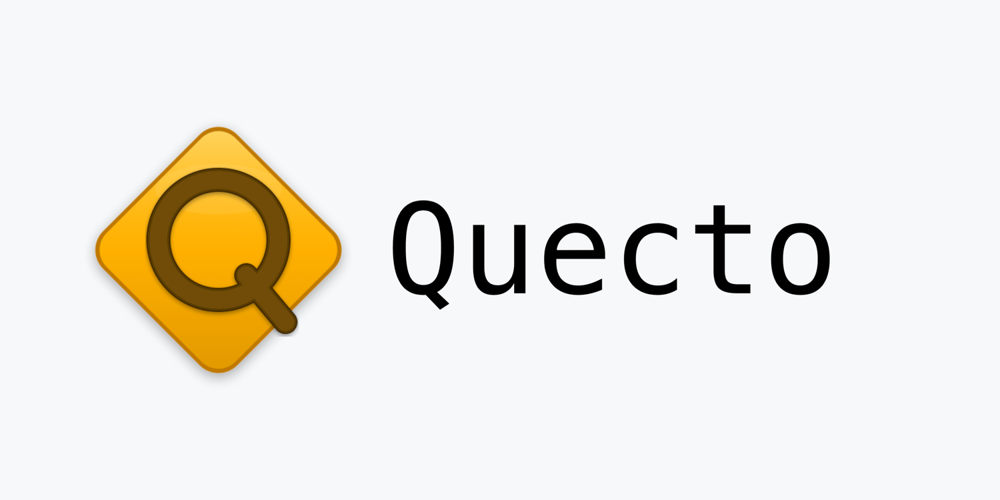

# quecto



A small but useful terminal-based text editor, written in ANSI C, designed for simplicity and tiny binary size.

---

## Features

- **Tiny & fast**: Minimal codebase, lightning startup, no dependencies except the standard C library.
- **Keyboard-controlled**: Familiar navigation and editing (arrow keys, Home/End, Ctrl+W to save, Ctrl+Q to quit, etc.).
- **Soft line wrapping** and clean UI.
- **Code clarity**: Less than 1000 lines including header; easy to audit or extend.
- **Installable**: Makefile for easy build/install/uninstall, installs as `quecto` and alias `q`.
- **MIT Licensed**.

---

## Getting Started

### 1. Build

Clone and build with:

```sh
git clone https://github.com/RYSF13/quecto
cd quecto
make build
```
This produces the `quecto` binary.

---

### 2. Install

System-wide install (requires sudo):

```sh
sudo make install
```
By default, this installs the binary to `/usr/local/bin` as `quecto` and also creates a symlink `q` for quick launch.

- To install to a different prefix (e.g., user local bin):

  ```sh
  PREFIX=$HOME/.local make install
  ```

---

### 3. Uninstall and Clean

- Remove installed files:
  ```sh
  sudo make uninstall
  ```
- Clean local build files:
  ```sh
  make clean
  ```

---

## Usage

### Starting the editor

```
quecto [filename]
```
Or use the short command:
```
q [filename]
```
If no filename is given, you can start editing and later choose a name with **Ctrl+N** (“New filename”).

---

### Keyboard Commands

| Key               | Action                             |
|:------------------|:-----------------------------------|
| `Ctrl+W`          | Save (writes to disk)              |
| `Ctrl+Q`          | Quit (prompts if changes present)  |
| `Ctrl+N`          | Save As (choose a new filename)    |
| `Ctrl+K`          | Insert an ASCII code               |
| `Ctrl+V`          | Show version info                  |
| Arrow Keys        | Move cursor                        |
| `Home` / `End`    | Move to line start/end             |
| `PageUp`/`PageDown` | Move up/down a screenful         |
| `Backspace`       | Delete character before cursor     |
| `Delete`          | Delete character under cursor      |
| `Esc` / `Ctrl+L`  | (Ignored / Redraw screen)          |

- Whenever you make unsaved changes, a `*` will appear by the filename.
- On attempting to quit with unsaved changes, you must press `Ctrl+Q` twice, for safety.

---

### Example Workflow

```sh
quecto notes.txt      # Opens 'notes.txt' or creates it if missing
# Type as you wish, move with arrow keys
# Press Ctrl+W at any time to save
# Press Ctrl+Q to quit. If unsaved, press Ctrl+Q again to confirm.
```
You can create a new file directly, or start editing and use Ctrl+N to choose a filename before saving for the first time.

---

## File List and Structure

| File         | Purpose                                         |
|:-------------|:------------------------------------------------|
| `quecto.c`   | Main code logic (UI, editing, rendering, I/O)   |
| `quecto.h`   | Data structures, helper/static functions, macros|
| `Makefile`   | For building, installing, uninstalling, cleaning|

- **No external libraries required.** Only a C99-capable compiler and a POSIX-like terminal needed.

---

## Advanced

- Build a statically-linked binary (e.g., for Alpine Linux):

  ```sh
  make STATIC=1 build
  ```

- All Makefile targets explained:

  ```sh
  make help
  ```

- The binary is very small! Great for rescue environments, Docker, and learning.

---

## License

This project is licensed under the MIT License.

---

## Author

**RYSF13**  
[https://github.com/RYSF13/quecto](https://github.com/RYSF13/quecto)

---

Feel free to fork and extend!
